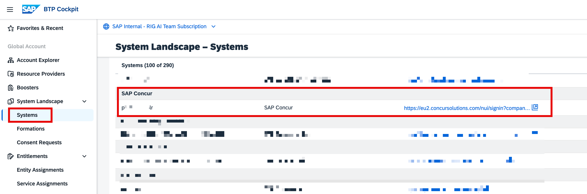

**Scenario 1: Joule in SAP Concur - new setup**

As mentioned above, for the new Joule setup in SAP Concur, you can follow the steps below.

You can follow the below steps - [Joule Setup – End-to-End Setup Guide (for all Line of Business) Unified Approach](https://community.sap.com/t5/technology-blogs-by-sap/joule-end-to-end-setup-guide-for-all-line-of-business-unified-approach/ba-p/13964602).

**Note: Joule with SAP Concur does not use SAP Build Work Zone services as of this release.**

Check if your SAP Concur system is listed in the SAP BTP in the Systems section. 

 

Next, during the** Joule Booster **(an automated integration process), ensure that you select the SAP Concur system (Image 43, Image 44, and Image 45). As mentioned above, you should be able to see the Joule formation in Ready status.

This completes the setup process, and you should now be able to see the Joule icon in your SAP Concur tenant. However, we recommend following the steps **Post Booster Validation** below.

In case of a standalone setup of Joule with SAP Concur, you should be able to see the formation as below:

 
