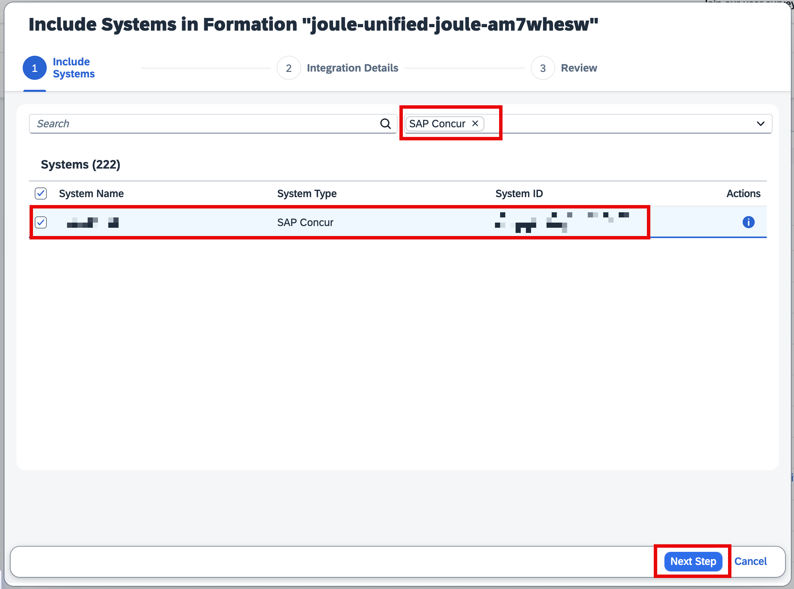
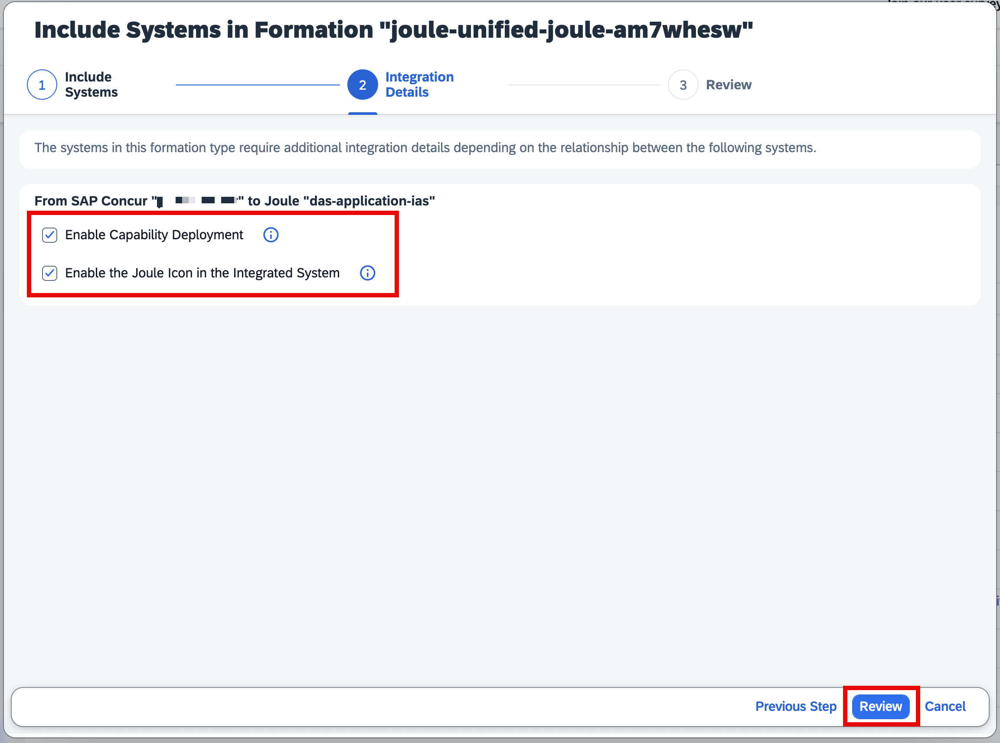
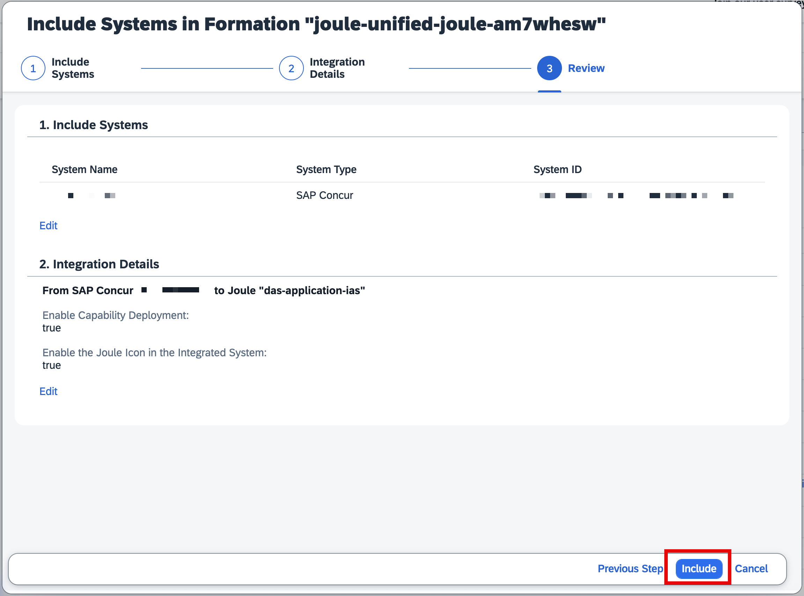

In this section, we will show you how to activate Joule in SAP Concur in the context of an existing Joule formation.

To integrate your system, you can navigate to your SAP BTP Formations, look for the existing formation, and click on Include system.

Note:

Please ensure you have the same **SAP Cloud Identity Services** used for your Unified Setup, as shown in the image below, and that the prerequisites are completed
If you are using the SAP Concur sandbox/test system for initial setup with other SAP LoB Applications,  we understand that the users may be appended with “xxx@xx.uat” in your SAP Concur for Login. Please ensure you are using a common email address in all your non-prod systems, which can be authenticated by SAP IAS and can help you achieve a unified Joule experience

If you have a large list of systems, you can filter it by SAP Concur, select the system you would like to integrate with Joule, and click on **Next Step**.

Select both the options listed “**Enable Capability Deployment**” and “**Enable the Joule Icon in the Integrated System**” click on **Review**. This will deploy the concur scenarios and also activate the Joule icon in the system.

Please review the selections and click on **Include**

The setup should normally take 5-8 minutes. You should be able to see a processing message and then finally enter a ready state, as shown below.

This confirms that the setup has been completed, and you should be able to see the Joule icon in your system. Please ensure you complete the next steps before you access Joule
