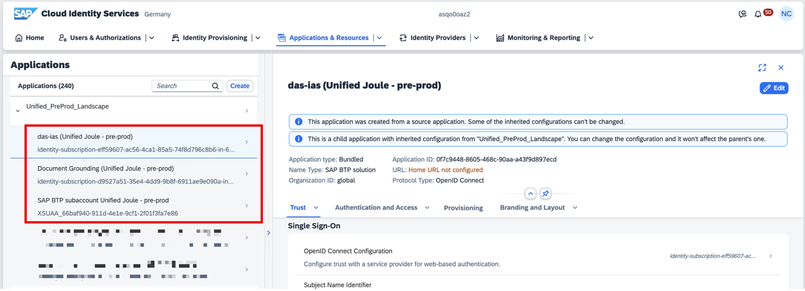
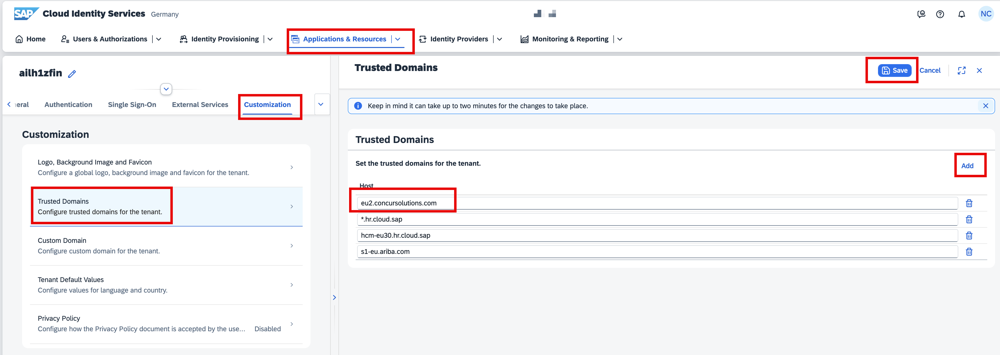
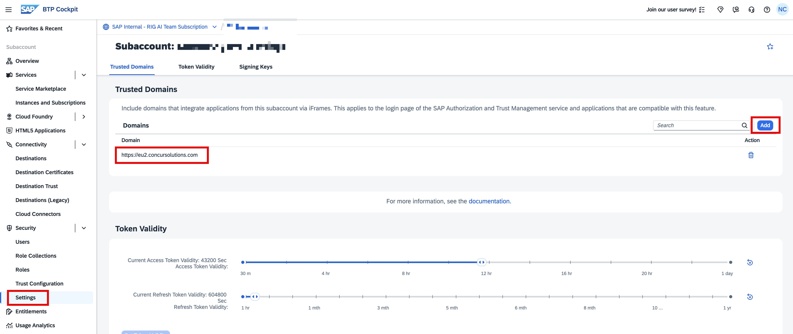
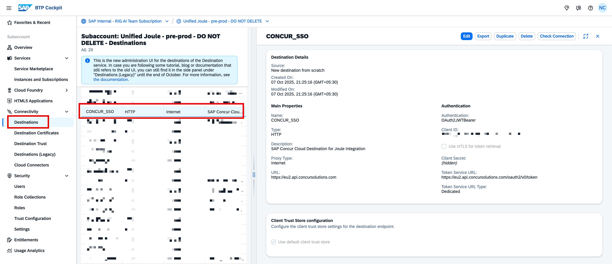

**1. Validate Application List**

Upon Joule integration, multiple background activities run to make the integration successful. You can navigate to your SAP Cloud Identity Services to check if the following Applications are created. 

 

**2. Trusted Domains**

We will add the SAP Concur systems to the Trusted Domain. To do this, click on **Application & Resources** -> select **Tenant Settings** -> select **Customization** -> click on **Trusted Domain**, click on **Add**, enter your **SAP Concur URL**, and click on **Save**.

In case of **Sandbox/Test** System setup, please check your SAP Concur tenant URL and add it accordingly. E.g.  [implementation.concursolutions.com](https://implementation.concursolutions.com/).

 

Similar settings should be maintained in your **SAP BTP Subaccount**. Expand the **Security** option, click on **Settings**, and **add** the SAP Concur domain, as shown below.

 

**3. SAP Concur Destination in your SAP BTP Subaccount**

You should also be able to see a Concur SSO destination in your SAP BTP Subaccount, as shown below. 

 

This completes the setup of Joule with your SAP Concur system.
