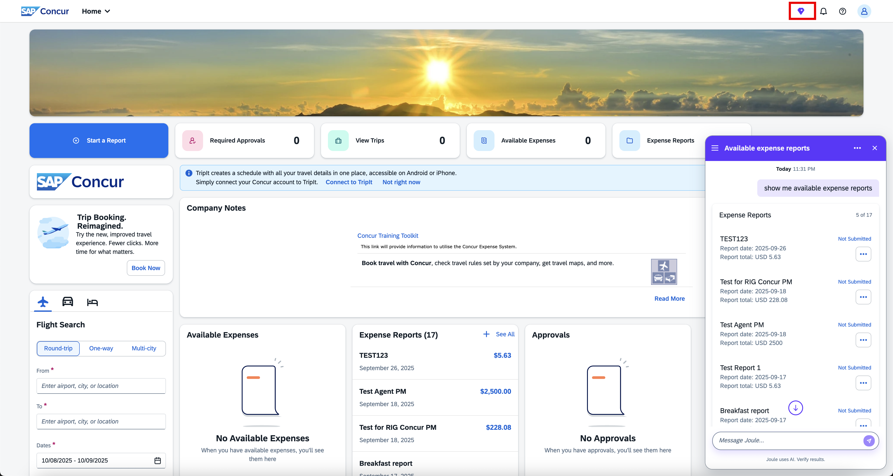

You can now log in to your SAP Concur system, and you should be able to see the Joule icon, click on it to launch the Joule client as shown below.

 

You can find all the Joule use cases with SAP Concur – [Transactional Use Cases](https://help.sap.com/docs/SAP_CONCUR_SECURITY/e956b5b6a0d2423cac014094834b5b3c/41615712562a49c592042e44425259f1.html) and [Informational Use Cases](https://help.sap.com/docs/SAP_CONCUR_SECURITY/e956b5b6a0d2423cac014094834b5b3c/f7ae35c9c7804882b9da4d0d115e33bb.html).
